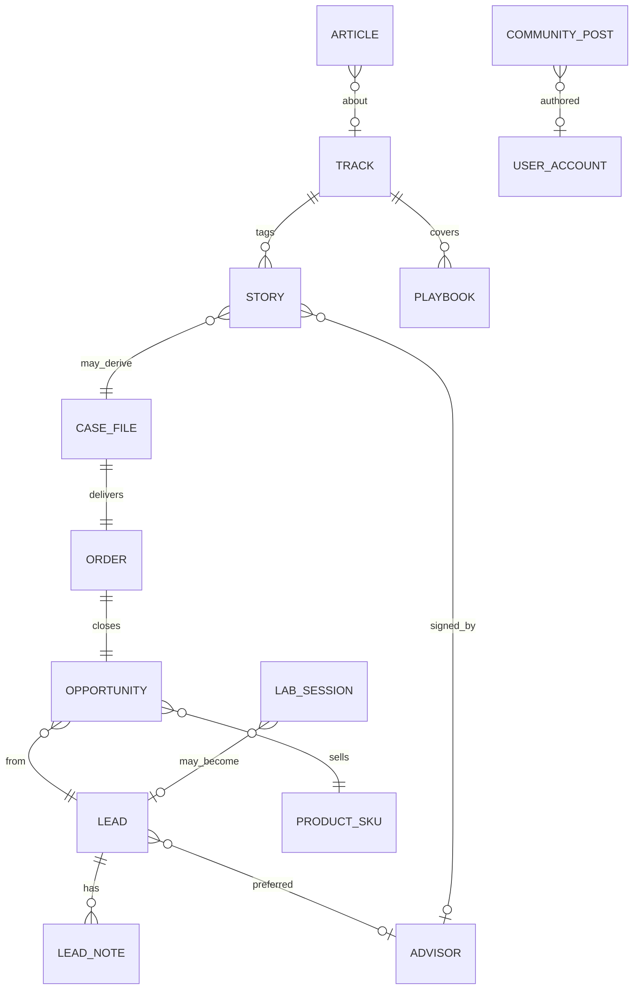
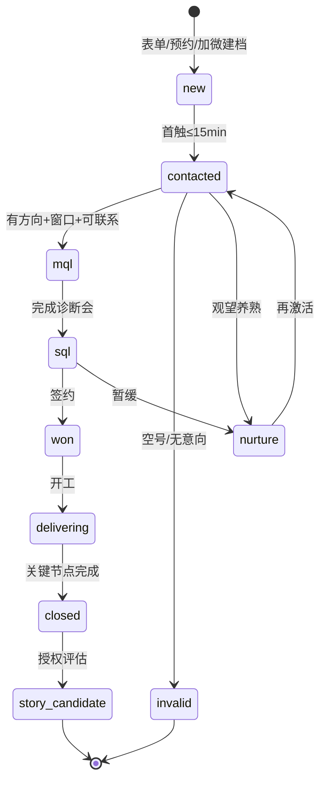
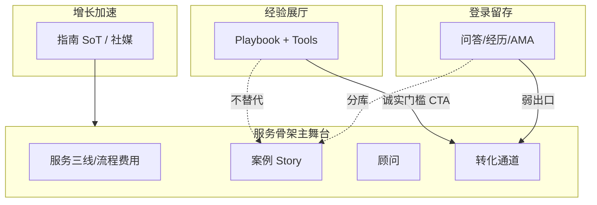
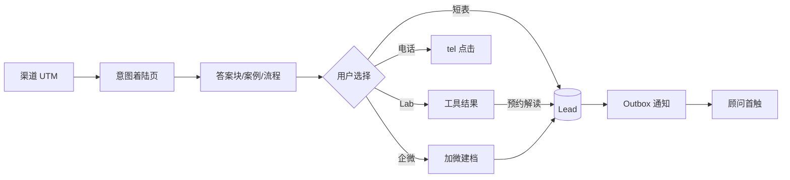
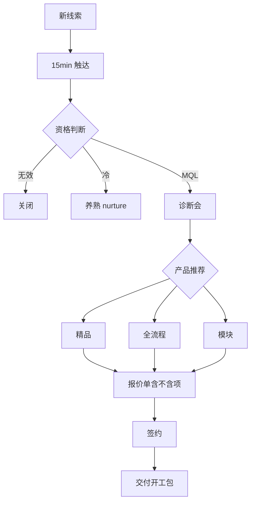

# 业务设计方案

| 项 | 内容 |
|---|---|
| 文档 | D2 |
| 版本 | v1.0 |
| 日期 | 2026-09-28 |
| 上游 | PRD v2.2、业务架构 v2、中国区 15 条原则、调研六层结构 |
| 下游 | D3 技术 / D4 IA / D5 组件 |

---

## 1. 设计目标与约束回溯

| 决策 | 对应依据 |
|---|---|
| 产品组合 = 精品 + 全流程 + 垂直包装 | 业务架构 B-ADR-01/02；调研 §6.3 |
| 垂直是获客包装，非无限 SKU | 业务架构 §3.1；原则 #10 |
| 主 CTA = 免费评估/规划 | 原则 #3；前途/Crimson 习惯 |
| 微信与表单并列，微信第一 | 原则 #2；调研 §4.5 |
| Lab 服务信任，不抢服务骨架 | Lab 说明 §0；PRD §6.12 |
| 社区弱转化、不替代案例/顾问 | 社区说明 §0；PRD §6.11 |

---

## 2. 业务对象模型

### 2.1 核心对象关系



### 2.2 对象字典（设计层）

| 对象 | 业务含义 | 关键属性 | 前台可见？ |
|---|---|---|---|
| **ProductSKU** | 可售卖单元 | `premium_*` / `full_cycle_*` / `module_*` | 通过服务页表达，非电商 SKU 墙 |
| **Track** | 垂直赛道包装 | us-ug / uk-pg / hk-sg / k12 / arts | `/tracks/*` |
| **Lead** | 留资访客 | 手机、意向、UTM、状态、preferred_advisor、同意版本 | 否（感谢页仅确认） |
| **Opportunity** | 商机 | 产品线、报价、异议、预计签约日 | 否（顾问侧） |
| **Order** | 合同 | SKU、金额、起止、退费摘要 | 否（可链 PDF 摘要） |
| **CaseFile** | 交付个案 | 节点状态、家长同步记录、结果 | P2 门户前仅顾问侧 |
| **Story** | 官方案例 | 授权、背景档、难点、结果、上下架 | `/cases` |
| **Advisor** | 顾问 | 方向、年限、代表案例、接评估开关 | `/advisors` |
| **Article** | SoT 指南 | 答案块、FAQ、social_hooks | `/guides` |
| **Playbook** | Lab 最佳实践 | 适用/不适用、DIY 天花板 | `/lab/playbooks` |
| **LabSession** | 工具使用草稿 | 工具类型、结果 JSON、可选留资 | 结果页本地/可选入库 |
| **CommunityPost** | 社区 UGC | L1 登录可见、审核状态、标注类型 | `/community` |
| **Event** | 活动/AMA | 时间、赛道、报名 | `/events` |

### 2.3 SKU 与垂直包装关系（硬决策）

```
前台叙事（获客）          后台成交（SKU）
─────────────────        ────────────────
/tracks/us-ug     ──┐
/tracks/uk-pg     ──┼──→  精品咨询包 / 全流程包 / 模块加购
/tracks/hk-sg     ──┤     （同一线索池、同一顾问产能）
/services/premium ──┘
```

| 规则 | 说明 | 依据 |
|---|---|---|
| 垂直 ≠ 独立产品线 | 垂直页决定话术、案例池、顾问匹配、表单 `track` | B-ADR-02 |
| 成交落 SKU | 报价单写「精品-文书模块」等，不写「美本产品 SKU-37」 | 防 SKU 爆炸 |
| 一条线索可换线 | 首咨后可从垂直意向改为精品/全流程 | 业务架构 §7.3 |

---

## 3. 服务产品架构

### 3.1 三线定义

| 线 | 适合谁 | 不适合谁 | 主 CTA | 客单价假设 |
|---|---|---|---|---|
| **精品咨询** | 冲顶尖、要策略密度、可模块拆买 | 只要「代填表格」最低价 | 预约评估（45–60min） | 高 |
| **全流程** | 要清单化、怕踩坑、要家长同步 | 只要单文书且无签证行前 | 获取方案与报价 | 中–高 |
| **垂直页** | 已定赛道的高意图访客 | —（包装层） | 评估我的背景 | 导流至上两线 |

### 3.2 六层专业结构自检

| 层 | 业务设计落点 | P0 就绪？ |
|---|---|---|
| 1 三维 IA | Track × Country × Service | 是 |
| 2 顾问+案例 | Advisor 可指定；Story 含难点 | 是 |
| 3 生命周期 | Process ≥5–7 步 + 交付物 | 是 |
| 4 多通道转化 | 企微 + 短表 + tel + 预约 | 是 |
| 5 工具 | Lab 评估/时间轴/清单/费用 | 是（建议同期） |
| 6 内容引擎 | Guides + Events + 答案块 | 是 |

### 3.3 精品 vs 全流程交付对照

| 阶段 | 客户可见交付物 | 精品 | 全流程 |
|---|---|---|---|
| 规划 | 诊断纪要、目标院校逻辑 | ● | ● |
| 背景 | 背景建议清单 | ● | ◐ |
| 考试 | 时间窗与目标分建议 | ◐ | ◐ |
| 申请 | 选校表、文书节点、递交清单 | ●（策略/文书包） | ● |
| 签证 | 材料清单与进度 | ○ 加购 | ● |
| 行前 | 行前清单 | ○ 加购 | ● |
| 境外/就业 | 默认不含，须写清 | ○ | ○ |

---

## 4. 线索与成交 SOP

### 4.1 线索状态机



### 4.2 SLA 与值班（设计层细则）

| 规则 | 标准 | 页面承诺文案示例 |
|---|---|---|
| 工作时间首触 | ≤15 分钟（电话或企微） | 「工作日通常 15 分钟内联系」 |
| 非工作时间 | 自动回复 + 次一工作日 XX 点前 + 引导加微 | 「已收到，将于次日 10:00 前联系；可先加企微」 |
| 无效关闭 | 3 次未接通或明确无意向 | 不展示给用户 |
| 案例下架 | 授权撤回后 24h 内不可见 | — |

**依据：** 原则 #14；业务架构 §6.3。

### 4.3 顾问分配规则（P0 人工）

1. 若 `preferred_advisor` 有值且该顾问「接评估=开」→ 优先分配。  
2. 否则按 `track` 匹配擅长赛道顾问。  
3. 产能满则负责人兜底或进入队列（页面仍承诺响应，不承诺指定顾问必得）。  
4. P1：企微机器人按方向路由 + SLA 标红。

### 4.4 话术边界（签约前）

| 允许 | 禁止 | 依据 |
|---|---|---|
| 「评估后给出选校逻辑与报价因子」 | 「包录 / 内部名额 / 保证录取」 | 原则 #12；调研红线 |
| 「个案不代表概率」 | 「成功率 99% / X 倍」 | 广告法；金吉列类表述不照搬 |
| 「含什么 / 不含什么」书面列清 | 签约才首次披露价格逻辑 | 原则 #7 |
| 说明销售与执行分工（若有） | 顾问与执行人分离且官网不说明 | 差异化「执行透明」 |

### 4.5 家长同步节奏（签约后 SOP）

| 节点 | 同步方式 | 内容 |
|---|---|---|
| 开工日 | 企微群建群 | 时间线、责任人、沟通约定 |
| 关键节点当日 | 企微消息 | 交付物链接/摘要 |
| 每周（全流程） | 周摘要 | 本周完成 / 下周计划 / 待家长决策项 |
| 结果节点 | 当日 | Offer/签证结果 + 下一步选项 |

**依据：** 原则 #1；业务架构 §7.5。

### 4.6 诊断会结构（45–60min）

1. 背景核对（成绩、语言、时间窗）  
2. 目标与约束（预算、家长偏好、冲刺意愿）  
3. 路径选项（精品模块 vs 全流程）  
4. 报价因子说明 + 不含项  
5. 下一步：报价单有效期 / 或养熟清单  

尽量学生+家长同场；不能同场则发纪要可转发（原则 #1）。

---

## 5. 内容 / Lab / 社区业务规则

### 5.1 三者分工（防抢戏）



| 模块 | 业务角色 | 不得做 |
|---|---|---|
| **指南** | 回答一个搜索问题 → 导入骨架 | 代替案例库证明结果 |
| **Lab** | 证明「有方法论可自助摸」；筛高意向 | 伪录取率；未出结果锁表单 |
| **社区** | 同伴感与回访；官方精选冷启动 | 公开 UGC SEO 金矿；马甲灌水 |
| **案例库** | 可核验社会证明 | 与社区 Offer 墙混库 |

### 5.2 Lab 业务规则

1. 每个工具结果页强制四段：摘要 / 口径 / DIY / 介入信号。  
2. 轻工具可匿名；「保存方案」才可选留资。  
3. 文书类仅大纲脚手架，不代写终稿。  
4. Lab 可 SEO；社区不可。  
5. 主 CTA「用工具自检」；次 CTA「预约解读」。

**依据：** Lab 说明 §4；原则 #8。

### 5.3 社区业务规则

1. L0 公网仅摘要/活动预告；L1 登录全文。  
2. 冷启动标注：`官方精选` / `特邀在读` / `顾问观察`。  
3. 先审后发（冷启动）；公约勾选后可发帖。  
4. 社区结果分享 ≠ 官网 Story。  
5. 顾问徽章发言禁止承诺录取。

**依据：** 社区说明 §3–6；原则 #12。

### 5.4 内容运营日历（建议节奏）

| 频率 | 动作 | 所有权 |
|---|---|---|
| 每周 | 1 篇 SoT 更新或新发；原子切片 ≥2；增长站会 | 运营 |
| 双周 | 内容评审（过期、互链、答案块质量） | 运营+负责人 |
| 每月 | 1 场活动/AMA；合规抽检话术与案例授权 | 运营+顾问 |
| 每季 | 国家/费用页年份复核；Playbook 增补 | 顾问+运营 |

---

## 6. 与 PRD 能力域对照

| PRD 能力域 | 本业务设计章节 | 设计补充点 |
|---|---|---|
| A 三维 IA | §2 Track；D4 | 2 次点击路径验收 |
| B 服务产品化 | §3 | 适合/不适合边界文案位 |
| C 国家内容 | 运营日历 + D4 国家模板 | 年份与来源类型标注 |
| D 案例 | §2 Story；§4.4 | 难点字段强制；下架 SLA |
| E 顾问 | §4.3 | 指定顾问产能满时文案 |
| F/G 流程费用 | §3.3；§4.5 | 家长三件套主场 |
| H 转化 | §4 | 渐进表单 + 蜜罐 + 同意 |
| I 活动 | §5.4 | 诚实「即将公布」态 |
| J/R Lab | §5.2 | 不抢骨架 |
| K 内容 | §5.1/5.4 | 答案块+下一站 |
| L/M 增长 | §5.4；UTM 字典沿用 PRD | 回链 SoT |
| N 合规 | §4.4 | 投诉入口 |
| O 后台 | D3 | 线索导出+通知 |
| P 站内探索 | D5/D7 | 清晰感驱动 |
| Q 社区 | §5.3 | P1 主航道 |

---

## 7. 关键业务流程图

### 7.1 获客→线索



### 7.2 线索→签约



---

## 8. 业务 ADR（设计层追加）

| 编号 | 决策 | 理由 |
|---|---|---|
| D-B-01 | 垂直页表单必带 `track` | 归因与顾问匹配 |
| D-B-02 | 指定顾问失败时降级为「方向匹配顾问」 | 产能诚实，不伪造档期 |
| D-B-03 | Lab 转化弱于服务页 | 先给价值，降低销售感（Lab G2） |
| D-B-04 | 社区默认 P1，不挡 P0 骨架验收 | PRD §4.3 / 社区排期 |
| D-B-05 | 价格表达采用「逻辑+区间」为主 | 比无忧更稳；原则 #7 |

---

**D2 结束。** 下一步：D4 信息架构与页面；对象入库细节见 D3。
