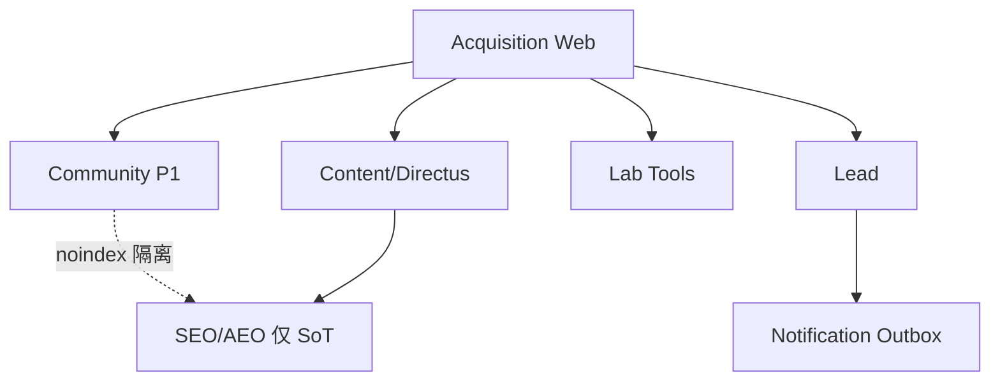

# 技术设计方案（修订版）

| 项 | 内容 |
|---|---|
| 文档 | D3 |
| 版本 | v1.0（相对 `留学服务官网_技术架构文档.md` 的 v2 能力修订） |
| 日期 | 2026-09-28 |
| 现网基线 | 香港服务器：`/data/studyabroad`、Next.js、PostgreSQL、Redis、Directus、本地 uploads |
| 上游 | PRD v2.2、业务架构 §9、D2 对象模型 |

---

## 1. 与 HK 现网衔接原则

| 现状资产 | 设计决策 | 说明 |
|---|---|---|
| Next.js 应用 | **保留**为唯一 Web/BFF | App Router；SSG/ISR + Route Handlers |
| PostgreSQL | **保留**；线索/同意/outbox/社区账号进 PG | Directus 可同库分 schema 或同库多 collection |
| Redis | **P0 启用**限流与会话 | 原技术文档写 P1；现网已有则提前用于 Lead 限流 |
| Directus | **定为 Headless CMS** | 内容模型见 §5；不另引入 Sanity/Strapi |
| `/data/studyabroad` + 本地 uploads | **P0 继续本地磁盘**；P1 可迁 S3 兼容 | 路径约定见 §9 |
| 邮件/企微 | Outbox 模式不变 | 入库优先于通知 |

**T-ADR-R01：** 不推翻现网栈；本方案是「能力域对齐 PRD v2」的增量修订。  
**T-ADR-R02：** 生产远期仍建议大陆备案源站（原 T-ADR-05）；HK 可作为当前生产/预发，需接受百度抓取与延迟折中，并在经营会记录。

---

## 2. 系统上下文

```
[百度/谷歌/豆包] [微信内置浏览器] [小红书/抖音 UTM]
                    │
                    ▼
        ┌───────────────────────────┐
        │  Next.js @ /data/studyabroad │
        │  访客站 + /api + /admin 壳   │
        └─────────────┬─────────────┘
          ┌───────────┼───────────┐
          ▼           ▼           ▼
     Directus      PostgreSQL    Redis
     (CMS)         (Lead/社区/   (限流/会话)
                   outbox)      
          │
          ▼
     uploads/ (本地) ──P1──► 对象存储
          │
          ▼
     SMTP / 企微 Webhook / GA4·百度统计
```

**系统外（本周期不做）：** 完整 CRM、支付中台、院校网申 API、学员门户、短视频工厂。

---

## 3. 域划分

| 域 | 职责 | 承载 | 分期 |
|---|---|---|---|
| Acquisition Web | 渲染、Metadata、JSON-LD、llms、sitemap | Next | P0 |
| Content | 指南/案例/顾问/Track/Faq/Playbook/活动 | Directus → Next fetch | P0 |
| Lead | 留资、同意、状态、导出、通知 | PG + `/api/leads` | P0 |
| Lab Tools | 评估/时间轴/清单/费用等 | Next API + 可选 `lab_sessions` | P0–P1 |
| Community | 账号、帖、审核、登录墙 | PG + Next；**与 SEO 隔离** | P1（P0 可选最小集） |
| Identity Admin | 后台 RBAC | Directus 用户 + Next admin session | P0 |
| Notification | Outbox → Mail/WeCom | PG outbox + cron | P0 |
| Analytics | 埋点约定 | 前端 SDK | P0 |
| Growth | 短链、UTM 管道 | `/go/*` P1 | P1 |
| Delivery | 学员进度 | — | P2 |



---

## 4. 数据模型（关键表）

### 4.1 PostgreSQL（应用库）

**leads**（沿用并扩展）

| 字段 | 类型 | 说明 |
|---|---|---|
| id | uuid PK | |
| name | varchar(40) | |
| mobile | varchar(32) | 存储策略：应用层加密或库权限+脱敏展示 |
| wechat | varchar(64)? | |
| track | varchar(32) | us-ug / uk-pg / hk-sg / k12 / arts / undecided |
| intent_year | varchar(16)? | |
| education_stage | varchar(32)? | |
| source_url | text | |
| landing_slug | varchar(128) | |
| utm_source/medium/campaign/content | varchar? | |
| form_variant | short\|book\|tool\|event\|community | |
| event_slug | varchar? | |
| lab_tool | varchar? | |
| preferred_advisor_id | uuid? | |
| status | enum | new/contacted/mql/sql/invalid/won/nurture |
| consent_at | timestamptz | |
| privacy_version | varchar(32) | |
| honeypot_hit | bool default false | |
| created_at / updated_at | timestamptz | |

**lead_notes** — advisor_id, body, created_at  

**outbox_notifications** — type, payload_json, status, attempts, next_run_at  

**consent_records** — lead_id, policy_version, ip_hash, user_agent, created_at（可与 lead 内嵌二选一，推荐独立便于审计）

**lab_sessions**（P0 可选）— id, tool, input_json, result_json, lead_id?, created_at  

**community_users**（P1）— id, mobile_hash, display_name, role_tags, created_at  

**community_posts**（P1）— id, author_id, channel, title, body, visibility(L0_summary/L1), moderation_status, supply_label(official/invited/advisor/user), noindex=true  

**community_reports** — post_id, reason, status  

**settings** — key/value（电话、微信图 URL、隐私版本、统计 ID）  

**redirects**（P1）— from_path, to_path, code  

**short_links**（P1）— code, target_url, click_count  

### 4.2 与 Directus 的边界

| 进 Directus | 进应用 PG |
|---|---|
| Article, Case, Advisor, Track, Country, Faq, Event, Playbook, LabTool 配置, School(P1) | Lead, Outbox, LabSession, Community*, Settings 运行时, Consent |

媒体文件：Directus 本地 uploads → Next `next/image` 或静态代理；密钥仅服务端。

---

## 5. Directus 内容模型草案

| Collection | 关键字段 | 发布闸门 |
|---|---|---|
| **tracks** | slug, name, hero_claim, answer_block, audience_fit/unfit, timeline_json, fee_framework, methods[3], faq_json, seo, parent_block | answer_block 非空 |
| **articles** | slug, title, summary, answer_block, body, category, tags, byline, published_at, updated_at, faq_json, social_hooks, related≥2 | 答案块+meta+推荐 |
| **cases** | slug, track, background_tier, background_summary, difficulty, strategy, execution, result, advisor, authorized, status | authorized=true |
| **advisors** | slug, name, photo, years, tracks[], method_one_liner, accept_booking, case_links, parent_sync_note | 真人照片+方向 |
| **countries** | slug, name, conditions, cost_year, timeline, visa_notes, risks, related_tracks | 年份标注 |
| **faqs** | question, answer, entity_type, entity_id | — |
| **events** | slug, title, start_at, format, tracks[], agenda, status(published/upcoming/ended) | 禁止假场恐吓文案 |
| **playbooks** | slug, track, fit/unfit, steps, diy_ceiling, pitfalls, cta_tool | DIY 天花板必填 |
| **lab_tools** | slug, name, layer(L1–L4), config_json, result_template | 结果四段模板 |
| **pages** | 关于/信任等单页 | — |
| **globals** | brand_name, phone, wecom_qr, icp_text, privacy_version | — |

---

## 6. API 清单

### 6.1 公共

| 方法 | 路径 | 说明 | 分期 |
|---|---|---|---|
| POST | `/api/leads` | 创建线索；校验；限流；写库；outbox | P0 |
| GET | `/api/health` | 探活 | P0 |
| POST | `/api/lab/{tool}/run` | 工具计算（无伪概率）；可匿名 | P0 |
| POST | `/api/lab/{tool}/save` | 可选留资绑定 session | P0 |
| POST | `/api/events/{slug}/register` | 活动报名 → lead | P0 |
| GET | `/api/revalidate` | ISR secret | P0 |
| POST | `/api/community/auth/*` | 登录/注册 | P1 |
| GET | `/api/community/feed` | 需会话；全文 | P1 |
| POST | `/api/community/posts` | 先审队列 | P1 |
| GET | `/r/:code` 或 `/go/:channel` | 短链 302 | P1 |

### 6.2 `POST /api/leads` 合同

请求字段对齐原技术文档 §9.2，并增加：`eventSlug?`, `labTool?`, `educationStage?`。  
`website` 蜜罐有值 → 204 静默。  
未 `consent=true` → 400。  
响应 `201 { ok, leadId }`；限流 `429`。

**幂等：** 同 mobile+landingSlug 10 分钟内合并，不重复轰炸通知。

### 6.3 后台

| 资源 | 说明 |
|---|---|
| Directus App | 内容 CRUD（编辑角色） |
| `/admin/leads` | Next 管理壳或 Directus 扩展：状态、备注、CSV、preferred_advisor |
| `/admin/community/moderation` | P1 审核队列 |

鉴权：Admin Session Cookie，`SameSite=Lax` + CSRF；Directus 静态 token 仅服务端。

---

## 7. 鉴权与权限

| 角色 | 内容 | 线索 | 社区审核 | 设置 |
|---|---|---|---|---|
| admin | 全 | 全 | 全 | 全 |
| editor | CRUD 发布 | 只读 | 协助 | 否 |
| advisor | 只读内容 | 查看/改状态/备注 | 否 | 否 |
| readonly | 只读 | 脱敏列表 | 否 | 否 |
| community_user | — | — | 发帖（经审） | — |

社区登录：手机号验证码或微信体系（P1 选型）；**至少一种实名等级**（社区说明 §4.4）。

---

## 8. 微信 / 企微集成

| 能力 | 实现 | 分期 |
|---|---|---|
| 企微二维码展示 | globals.wecom_qr；组件 WeComDock | P0 |
| 复制微信号 | 可选字段 + clipboard 事件 | P0 |
| 线索邮件通知 | Outbox → SMTP | P0 |
| 企微群机器人 | Outbox → Webhook；按 track 路由 | P1 |
| 「已添加」回传 | 企微回调（若开通） | P1 |
| 微信内分享卡片 | OG 图 + title；真机测 | P0 |

不依赖微信网页授权登录作为 P0 转化前提（二维码加好友即可）。

---

## 9. SEO / AEO 与社区隔离

| 内容 | robots | index | sitemap | llms.txt |
|---|---|---|---|---|
| 骨架页/指南/案例/Lab Playbook | Allow | yes | yes | 核心 URL |
| `/thank-you` `/admin` `/api` | Disallow | no | no | no |
| `/community/**` 全文 | Disallow | **noindex** | **no** | **no** |
| 社区 L0 活动预告页 | 可 Allow | 可 index 标题级 | 可选 | no |

技术策略：社区布局强制 `robots: noindex,nofollow`；API 需会话；Redis 频控；ToS 禁止训练抓取。  
**依据：** 社区说明 §5；原则 #11 仅作用于 SoT。

---

## 10. Lab 与社区技术边界

| | Lab | Community |
|---|---|---|
| 渲染 | SSG 壳 + 客户端工具运行时 | CSR 为主 + 登录墙 |
| 数据 | Directus 配置 + 规则引擎计算结果 | PG UGC |
| SEO | 鼓励 | 禁止全文 |
| 转化 | `/api/leads` form_variant=tool | 弱链 `/book` |
| 风险 | 无伪概率文案校验（单测） | 审核队列 + 举报 |

---

## 11. 部署分期（贴合 HK 目录）

### P0

```
/data/studyabroad/
  apps/web/          # Next
  uploads/           # Directus + 本地
  .env               # DB/Redis/Directus/SMTP
docker 或 pm2: next start + directus + redis + postgres
cron: outbox worker（每分钟）
```

交付：ISR revalidate、sitemap、llms.txt、Lead API、基础埋点、微信真机验收。

### P1

- Redis 限流看板化；企微 Webhook  
- 社区域表 + 登录 + 审核后台  
- 短链 `/go`；媒体库治理；SLA 标红 SQL 视图  
- 可选 uploads → S3 兼容（保持 Directus 存储适配）

### P2

- 学员 Delivery 域  
- 社区防爬对抗升级  
- Admin 独立部署（若需要）

---

## 12. 可观测性与安全（增量）

- 日志：request_id；禁止打印完整手机号。  
- 告警：`POST /api/leads` 5xx、outbox 积压。  
- 表单：限流 + 蜜罐 + 手机号段校验。  
- CMS 富文本消毒。  
- 社区：发帖频控、异常 IP 暂封。

---

## 13. 技术 ADR 追加

| 编号 | 决策 | 理由 |
|---|---|---|
| T-ADR-R01 | 沿用 HK Next/PG/Redis/Directus | 任务书硬约束；降低迁移成本 |
| T-ADR-R02 | 内容进 Directus，线索进 PG | 编辑体验与事务一致性分离 |
| T-ADR-R03 | Redis P0 用于 Lead 限流 | 现网已具备；对齐 SLA 防刷 |
| T-ADR-R04 | 社区与 AEO 硬隔离 | 防挖矿 + 责任边界 |
| T-ADR-R05 | Lab run API 无登录默认可跑 | Lab 伦理：先给结果 |
| T-ADR-R06 | 本地 uploads P0 | 与现网一致；P1 再对象存储 |

---

## 14. 开放问题（需业务确认）

1. 大陆 ICP / 回源计划时间表？  
2. 社区登录：短信 vs 微信 vs 双持？  
3. 统计：GA4 / 百度 / 双持？  
4. Directus 与 Next 是否同机；备份策略 RPO？  

---

**D3 结束。** 字段级 UI 见 D5；验收见 D8。
