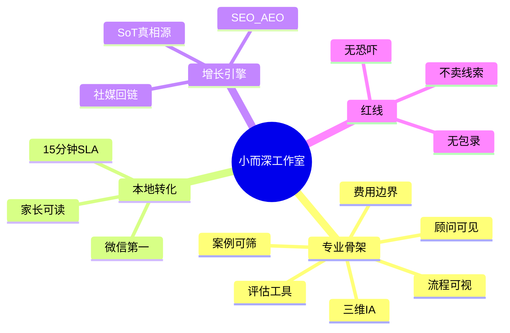
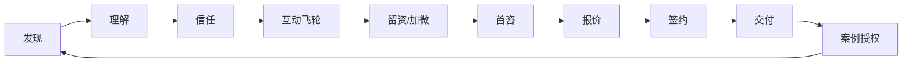
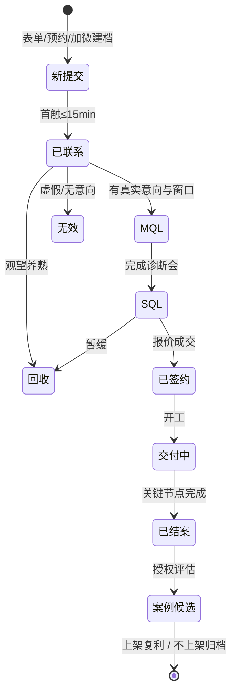
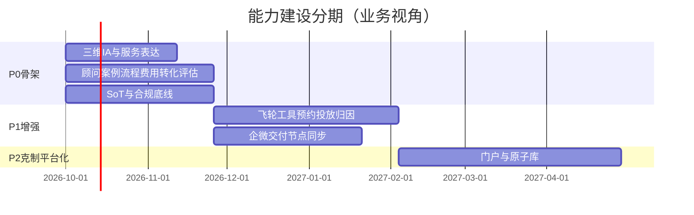

# 留学服务官网业务架构文档

| 项 | 内容 |
|---|---|
| 文档版本 | **v2.0** |
| 日期 | 2026-09-28 |
| 状态 | 评审稿；**取代** [业务架构 v1.0](./留学服务官网_业务架构文档.md) |
| 客群默认 | 中国大陆学生 + 家长（共同决策） |
| 上游依据 | [竞品调研报告](./竞品调研报告_全球与中国头部留学平台.md)、[中国区体验原则](./中国区留学用户行为与官网体验原则.md) |
| 下游关联 | [PRD v2.2](./留学服务官网_产品需求文档_v2.md)（含社区 Q、最佳实践 Lab R）、[社区飞轮设计说明](./留学社区飞轮_产品设计说明.md)、[最佳实践 Lab 设计说明](./最佳实践与自助工具箱_产品设计说明.md)、[技术架构](./留学服务官网_技术架构文档.md) |
| 适用范围 | 大陆市场「留学工作室」官网及获客—成交—交付—复利业务 |

> **v2 相对 v1 的核心升级：** 业务能力地图按头部「专业感六层骨架」对齐；明确「小而深」差异化与诚实分期；把增长飞轮定位为骨架上的获客引擎，而非骨架本身；补齐价值流、对标矩阵、系统域逻辑映射与合规闭环。

---

## 1. 目的与读者

### 1.1 目的

本文件定义工作室「做什么生意、为谁创造什么价值、价值如何流动、组织如何协作、能力如何分期建设」，作为创始人、运营、顾问、产品、技术对齐的**业务蓝图**。

| 本文回答 | 不回答 |
|---|---|
| 业务定位、产品组合、能力地图、闭环与分期 | 页面字段、交互细则（→ PRD v2） |
| 与头部对标的专业骨架与差异化边界 | 技术选型、部署与 API（→ 技术架构） |
| 组织 RACI、SLA、合规控制点 | 具体文案稿、视觉稿 |

### 1.2 读者

| 角色 | 关注章节 |
|---|---|
| 创始人 / 工作室负责人 | §2 愿景定位、§3 商业模式、§10 分期、§11 风险 |
| 运营 / 增长 | §5 能力地图、§8 飞轮、§4 价值流 |
| 顾问 / 销售 / 交付 | §6 组织、§7 线索—签约—交付闭环 |
| 产品 / 设计 | §2、§5、§9（与 PRD 边界） |
| 技术 | §9 系统域映射、§10 分期对技术退出标准的约束 |

### 1.3 架构原则（v2）

1. **能力蓝图专业，交付分期诚实**——官网结构与文档必须表达头部同级的专业骨架；实现体量可克制，但不能用「电子名片 + 飞轮口号」冒充专业感。  
2. **差异化小而深**——不拼网点、不拼全球项目库；用垂直方法论、顾问可见、执行透明证明价值。  
3. **飞轮挂在骨架上**——SEO/AEO/短视频是获客引擎，不能替代国家×学历×产品、顾问、案例、流程、转化、工具六层。  
4. **学生 + 家长双读者**——关键转化页必须有家长向信息（费用逻辑、边界、同步方式）。  
5. **合规优先于话术**——不承诺无法核验的录取结果；案例可下架、可脱敏。  
6. **微信是中国区第一转化通道**——表单与加微并列，不互斥。

---

## 2. 愿景与定位

### 2.1 愿景

成为大陆家庭「想留学时第一个被搜到、被 AI 提到、被同学安利，并且逛起来越来越清晰」的**垂直精品留学工作室入口**——专业表达对齐头部能力蓝图，体量与叙事保持小而深。

### 2.2 一句话定位

**搜索与 AI 把人送进来 → 站内三维信息与信任证明让人变清晰 → 免费评估把清晰变成线索 → 可见顾问把线索变成签约 → 透明交付产出可授权案例 → 案例与指南再喂回站外。**

### 2.3 战略定位：小而深

相对前途/启德/金吉列等连锁，以及 ApplyBoard 类平台、Crimson 类精品，本项目的定位选择如下：

| 维度 | 连锁（前途/启德等） | 撮合平台（ApplyBoard 等） | 海外精品（Crimson 等） | **本工作室** |
|---|---|---|---|---|
| 体量叙事 | 全国网点、海量 SKU | 全球项目库 | 藤校枚数墙 | **克制：少而准** |
| 信任机制 | 集团品牌 + 顾问库 | 账号与成功率营销 | Offer 墙 + 顾问背景 | **顾问可见 + 案例难点结构 + 过程透明** |
| 转化通道 | 400 + 微信 + 城市站 | 注册/账号 | 预约 + 微信（中文站） | **微信第一 + 免费评估 + 回电 SLA** |
| 差异化承诺 | 覆盖广 | 自助效率 | 结果量级 | **比连锁更深、比平台更暖、比海外更本地、比透明派更稳** |

**差异化四句话（来自竞品调研 §6.3，升格为业务战略）：**

1. **比连锁更深：** 垂直赛道方法论与执行透明（谁写文书、节点如何同步家长）。  
2. **比平台更暖：** 真人顾问可见，而非纯自助账号。  
3. **比 Crimson 更本地：** 微信优先、费用人民币表达、家长决策字段。  
4. **比无忧更稳：** 可公开价格逻辑与区间，但不靠「限时抢位」土促销。

### 2.4 做什么 / 不做什么

| 类别 | 内容 |
|---|---|
| **做（骨架）** | 国家×学历×产品三维 IA；可筛案例；可浏览/指定顾问；服务生命周期可视化；费用与边界透明；微信/企微即时咨询；活动/公开课；背景评估工具（可半自动） |
| **做深（垂直）** | 美本 / 英研 / 港新 / 低龄 / 艺术（五条；首发可缩为 2–3 条，蓝图保留五条） |
| **做（增长）** | 内容真相源 SoT、答案块、社媒切片回链、SEO/AEO |
| **暂缓（诚实分期）** | ApplyBoard 级全球项目库与一键网申；前途级全国城市分站与 200+ SKU；学员门户；语培自营 LMS；完整 AI 选校大库 |
| **永不做（品牌红线）** | 包录 / 内部名额；恐吓倒计时；无法核验的「成功率 X 倍 / 99%」主视觉；出售线索给第三方；顾问与执行人分离且官网不说明 |

### 2.5 价值主张画布（简版）

| 侧 | 内容 |
|---|---|
| 客户群 | 学生 + 家长（决策常共同完成；见中国区原则 §1） |
| 痛点 | 信息不对称、怕踩坑、怕销售话术、怕过程失控、怕隐性加价 |
| 获益 | 更快搞清适不适合；看见「像我」的路径；顾问可约诊；费用与边界可读；交付过程可同步 |
| 渠道 | 百度/谷歌、豆包等 AI、小红书/抖音/视频号、微信转介绍、讲座/教育展 |
| 收入 | 精品咨询费、全流程服务费、模块加购 |
| 成本 | 顾问人力、内容生产、投放、工具订阅、合规 |



---

## 3. 商业模式

### 3.1 收入结构

```
收入
├── 精品线（高客单）——策略 / 文书 / 背景 / 面试等产品包
├── 全流程线（主流量）——选校 → 材料递交 → 结果跟进 → 签证 → 行前
├── 模块加购 —— 单文书、签证加项、行前加项、面试加练（可选）
└── （未来，需单独合规评估）公开课/资料包、院校合作返佣
```

**业务规则：**

| 规则 | 说明 |
|---|---|
| 评估免费 | MVP 默认；不绑消费；主 CTA 为「免费评估 / 规划」 |
| 官网报价表达 | 展示计费逻辑或区间 + 不含项；可不展示精确总价，但禁止「签约才首次报价」 |
| SKU 收敛 | 垂直是获客与话术包装；后台 SKU 归并到精品 / 全流程 / 模块，避免爆炸 |
| 免费与付费边界 | 官网写清：评估/初诊免费；文书执行、递交代办、签证等属付费范围 |

### 3.2 成本结构（业务视角）

| 成本类型 | 典型项 | 与飞轮/闭环关系 |
|---|---|---|
| 变动 | 顾问跟进、签约交付工时 | 线索质量越高，单位获客后成本越低 |
| 半固定 | 内容写作、短视频、讲座 | 内容资产可复利，摊薄 CAC |
| 固定 | 域名托管、工具、基础投放测试 | 技术架构控制在可维护范围 |

### 3.3 单位经济模型（逻辑，非财务预测）

```
CAC  =（投放 + 内容分摊 + 工具）/ MQL（或 SQL）
贡献毛利 = 客单 × 毛利率 − 交付变动成本

健康条件（经营目标，非官网北极星）
  LTV / CAC ≥ 3（按服务周期计）
  自然/内容占比提升 → CAC 下降
```

官网经营北极星仍以 **合格线索（MQL）+ 飞轮健康度（页深/回链/收录）** 为准；签约营收由经营周会另表跟踪。

### 3.4 产品组合与客户分层

| 客户分层 | 特征 | 主推 | 官网路径（逻辑） |
|---|---|---|---|
| 冲刺型 | 冲顶尖、愿付高客单、要策略 | 精品线 | `/services/premium` |
| 省心型 | 要全包、怕踩坑、要节点透明 | 全流程线 | `/services/full-cycle` |
| 赛道明确型 | 已定美本/英研/港新等 | 垂直页 + 上两线之一 | `/tracks/*` |
| 观望型 | 只查费用/条件 | 内容飞轮养熟 → 评估 | `/guides/*` → 评估 |

```
产品组合（业务对象）
├── 精品咨询产品包
│   ├── 策略规划 │ 文书辅导 │ 背景规划 │ 面试辅导
├── 全流程服务产品包
│   ├── 评估选校 │ 材料与递交 │ 结果跟进 │ 签证 │ 行前
└── 垂直解决方案（包装层）
    ├── 美本 / 英研 / 港新 / 低龄 / 艺术
    └── 落地页 + 话术 + 案例池 + 顾问匹配规则
```

---

## 4. 价值流

### 4.1 端到端主价值链（Level 1）

```
发现 → 理解 → 信任 → 互动飞轮 → 留资/加微 → 首咨 → 方案报价
  → 签约 → 交付 → 结果沉淀 → 内容复利 → 再获客
```



### 4.2 价值流泳道（业务视角）

```
┌──────────┬────────────────────────────────────────────────────────────┐
│ 渠道/环境 │ 搜索·AI·社媒·转介绍·讲座                                    │
├──────────┼────────────────────────────────────────────────────────────┤
│ 访客      │ 着陆 → 读答案/案例/流程 → 对照「像我」→ 评估或加微           │
├──────────┼────────────────────────────────────────────────────────────┤
│ 官网前台  │ 三维IA · 信任证明 · 工具 · 多通道 CTA · SoT                  │
├──────────┼────────────────────────────────────────────────────────────┤
│ 线索中枢  │ 入库 · 分级 · SLA触达 · 预约 · 商机推进                      │
├──────────┼────────────────────────────────────────────────────────────┤
│ 顾问交付  │ 诊断会 · 报价 · 签约 · 节点履约 · 家长同步                   │
├──────────┼────────────────────────────────────────────────────────────┤
│ 增长运营  │ 原子拆解 · 分发 · UTM对账 · 过期复审 · 回写FAQ               │
└──────────┴────────────────────────────────────────────────────────────┘
```

### 4.3 价值创造与价值捕获

| 阶段 | 客户获得的价值 | 工作室捕获的价值 |
|---|---|---|
| 发现—理解 | 搞清条件、路径、费用总账感 | 会话、品牌记忆、索引资产 |
| 信任—互动 | 看见顾问与像我案例；流程可控感 | 页深、回访、评估意向 |
| 留资—首咨 | 免费规划、15 分钟级响应 | MQL / SQL |
| 签约—交付 | 透明节点、可同步家长 | 营收、口碑、可授权案例 |
| 复利 | 持续可信内容 | 更低 CAC、更强专业表达 |

### 4.4 关键价值泄漏点（须治理）

| 泄漏点 | 表现 | 治理 |
|---|---|---|
| 骨架缺失 | 只有口号无顾问/案例/流程 | 能力地图 P0 强制项 |
| 响应超时 | 留资后无人触达 | SLA ≤15 分钟 + 值班 |
| 口径漂移 | 社媒数字与官网冲突 | 官网唯一 SoT |
| 家长断层 | 只有学生向文案 | 转化页家长三件套 |
| 交付黑箱 | 签约后失联感 | 节点清单 + 家长同步 SOP |

---

## 5. 业务能力地图（与头部对标）

### 5.1 头部专业感六层骨架（必须对齐的蓝图）

竞品调研结论：头部「专业感」来自六层同时在线。本项目**蓝图全对齐**；**实现分期诚实**。

| 层 | 头部可观察特征 | 本项目蓝图要求 | P0 | P1 | P2 |
|---|---|---|---|---|---|
| 1. 三维 IA | 国家 × 学历 × 产品（前途双轴等） | 2 次点击内到意图页；五垂直可扩展为国家/学历入口 | ● 核心国家+学历+三线服务 | 国家/意图长尾页 | 院校深度档案（克制） |
| 2. 顾问 + 案例 | 可筛顾问；案例含背景→结果 | 顾问可浏览可指定；案例可筛 +「申请难点」结构 | ● 基础库 | 筛选强化 | 顾问档期联动 |
| 3. 生命周期可视 | STEP/服务全景 | ≥5 步流程；标明客户可见交付物 | ● | 节点与家长同步文案强化 | 学员侧进度可见 |
| 4. 多通道转化 | 400/微信/表单/回电 | 微信第一 + 短表单 + 回电 SLA；电话可选 | ● | 日历预约 | 智能分流 |
| 5. 工具层 | 评估/选校/费用/GPA/AI | 至少背景评估；选校短名单/费用估算可半自动 | ● 评估 | ◐ 费用/短名单 | AI 匹配（克制） |
| 6. 内容引擎 | 资讯/白皮书/讲座/SEO | SoT 指南 + 活动 + 答案块；飞轮挂骨架上 | ● 指南+FAQ | 讲座/白皮书级长文 | 个性化信息流 |

● 必须就绪　◐ 半自动/试点可接受

### 5.2 L1 能力域总览

```
L1 业务能力域
├── A. 品牌、信任与专业表达
├── B. 需求发现与获客
├── C. 内容真相源与站内飞轮
├── C′. 社区飞轮（登录可见互动层，与 SEO 隔离）
├── D. 线索经营与转化
├── E. 服务产品与交付
├── F. 多平台分发与回流
├── G. 数据洞察与迭代
└── H. 合规与风控（含社区 UGC 治理与反爬）
```

### 5.3 能力详表（含头部对标）

| ID | 能力 | 业务产出 | 头部对标参考 | MVP(P0) | P1 | P2 |
|---|---|---|---|---|---|---|
| A1 | 品牌叙事与产品三线表达 | 访客理解是谁、卖什么 | 前途方案产品化；啄木鸟分层命名 | ● |  |  |
| A2 | 案例授权、筛选与难点结构 | 可核验社会证明 | 无忧难点；前途案例+顾问署名 | ● | 强化筛 |  |
| A3 | 顾问人设、可指定评估 | 降低销售不信任 | 启德/金吉列顾问库 | ● | 匹配规则 | 档期 |
| A4 | 资质/页脚信任/投诉入口 | 机构可信 | 新通双热线；ICP/主体 | ● |  |  |
| A5 | 服务生命周期可视化 | 过程可控感 | 金吉列 STEP；新通全景 | ● |  | 门户进度 |
| B1 | SEO 获客（国家×意图） | 自然搜索会话 | Studyportals/Leap 长尾 | ● | 强化 |  |
| B2 | SEM / 信息流承接 | 高意图落地一致 | 国内站投放页 | ○ | ● |  |
| B3 | AEO / GEO 被引用 | AI 来源会话 | 答案块+FAQ Schema | 基础 | ● |  |
| C1 | 指南/垂直 SoT 生产 | 可收录正文 | 前途资讯+知识库 | ● |  |  |
| C2 | 答案块 + 下一站推荐 | 页深、停留 | 中国区原则 §9.11 | ● |  |  |
| C3 | 清单 / 测验 / 回访 | 微进展 | Shorelight quiz 思路 |  | ● |  |
| C4 | 个性化信息流 | 今日推荐 | — |  |  | ● |
| C5 | 活动 / 公开课运营位 | 讲座转化 | 前途讲座；启德直播 | ◐ | ● |  |
| C6 | 社区飞轮（问答/经历/AMA） | 回访与同伴感；弱转化 | Yocket 等社群启发；本站登录墙 | ○/◐ 最小精选 | ● 主航道 | 认证/积分 |
| C7 | 社区冷启动供给 | 有料不空城 | — | 官方精选+特邀 | 学员可选贡献 | UGC 自循环 |
| C8 | 最佳实践 Lab（Playbook+工具） | 经验可见；自助探索；诚实门槛 | 前途工具+知识库；Crimson Resources | ● 建议同期 | 扩展工具 | 个性化路径 |
| D1 | 多通道留资（含微信） | 线索入库 | 国内连锁标配 | ● |  |  |
| D2 | 线索分级与 SLA | MQL→SQL | 前途「15 分钟回电」 | 人工 | 半自动 |  |
| D3 | 预约与排班 | 首咨出席 | Crimson 预约咨询 | 偏好回拨 | 日历 |  |
| E1 | 精品交付 SOP | 高客单履约 | 精品工作室共性 | 线下 | 企微节点 | 门户 |
| E2 | 全流程节点交付 | 清单化履约 | 金吉列/新通全景 | 线下 | 企微同步 | 门户 |
| E3 | 费用逻辑与报价单规范 | 透明成交 | 无忧公开价（学逻辑不学促销） | ● 区间/逻辑 | 报价模板 |  |
| F1 | 内容原子拆解 | 站外素材 | Leap/Yocket 切片思路 | 手工 | 字段化 | 素材库 |
| F2 | 小红书/抖音/视频号分发 | 回链会话 | 国内站社媒矩阵 | UTM | 短链 | 日历 |
| G1 | 转化与飞轮指标 | 周复盘 | — | 基础埋点 | 看板 |  |
| H1 | 隐私同意与年龄声明 | 风险可控 | 前途/启德 18+ | ● |  |  |
| H2 | 案例/话术审核与下架 | 可撤回 | 广告法合规 | ● | 过期治理 |  |
| H3 | 社区公约/先审/举报 | UGC 责任可控 | 平台治理通识 | 社区上线时 ● | 机审 | 信誉分 |
| H4 | 社区防爬与 SEO 隔离 | 降低被挖矿 | — | noindex+登录墙+频控 | 监测看板 | 对抗升级 |

### 5.4 与头部能力对标结论（决策用）

| 对标项 | 对齐方式 | 明确不对齐（体量） |
|---|---|---|
| 专业骨架六层 | **蓝图与 IA 全对齐** | — |
| 顾问/案例深度字段 | 对齐启德/无忧的「可理解字段」 | 不对齐 600+ 顾问库体量 |
| 产品命名分层 | 对齐啄木鸟/启德的可理解包名 | 不对齐 200+ SKU |
| 工具矩阵 | 对齐「有评估入口」 | 不对齐前途全工具矩阵首发 |
| 转化密度 | 对齐微信+表单+回电 | 不对齐金吉列多层强制弹层 |
| 内容引擎 | 对齐意图长尾与答案前置 | 不对齐 Studyportals 全球工厂 |
| 网申中台 | — | **不做** ApplyBoard 级 |

### 5.5 能力依赖关系（简图）

```
        A 信任骨架 ─────────────────────────────┐
              │                                   │
    ┌─────────┼─────────┐                         │
    ▼         ▼         ▼                         ▼
   B获客 ←── C内容飞轮 ──→ D转化 ──→ E交付 ──→ A2案例回流
    │                     │              │
    └──────── F分发 ──────┘              │
                      G洞察 ◄────────────┘
                      H合规（横切全域）
```

---

## 6. 组织与角色

### 6.1 初创期最小编制（建议）

| 角色 | 人数（参考） | 业务职责 |
|---|---|---|
| 负责人 | 1 | 定价、红线、重大案例审核、渠道策略、产品边界 |
| 顾问 | 1–3 | 首咨、分级、签约、交付执行、家长同步 |
| 内容 / 运营 | 0.5–1（可兼职） | SoT、原子、平台发布、收录提交、活动页 |
| 设计 / 开发 | 外包或兼职 | 按技术架构交付前台与线索能力 |

> 小而深意味着：**顾问产能是瓶颈，不是页面数量**。能力建设优先级应优先保障线索 SLA 与交付口碑，而非堆砌与连锁同级的页面体量。

### 6.2 RACI（核心流程）

| 活动 | 负责人 | 顾问 | 运营 | 技术 |
|---|---|---|---|---|
| 定价与产品边界 | A | C | I | I |
| 官网能力蓝图变更 | A | C | C | C |
| SoT 发布 | A | C | R | C |
| 线索 15 分钟响应 | A | R | I | C |
| 案例上架授权 | A | R | C | I |
| 投放落地页一致性 | A | C | R | C |
| 隐私与免责文本 | A | I | C | C |
| 指标周报 | A | C | R | C |
| 话术 / 成功率表述审核 | A | R | C | I |

R=执行　A=问责　C=协商　I=知会

### 6.3 值班与 SLA（业务规则）

| 规则 | 标准 |
|---|---|
| 工作时间首触 | ≤ 15 分钟（电话或企微；页面写清预期） |
| 非工作时间 | 自动回复 + 次一工作时段前联系 + 引导加微信 |
| 无效线索关闭 | 3 次未接通或明确无意向 → 标记无效并停止骚扰 |
| 案例下架 | 授权撤回后 24 小时内前台不可见 |
| 家长同步（签约后） | 按 SOP：关键节点当日同步；周摘要（全流程） |

### 6.4 角色与客户接触面

```
家长/学生
    │
    ├─ 公域内容（运营）──► 官网 SoT
    ├─ 留资/加微（系统+顾问）──► 首触 SLA
    ├─ 诊断会（顾问）──► 方案与报价
    ├─ 签约（负责人审核边界）──► 合同
    └─ 交付同步（顾问）──► 节点可见物 + 家长周报
```

---

## 7. 线索到签约到交付闭环

### 7.1 闭环总览



### 7.2 获客到线索（Level 2）

```
渠道触达
  → 意图匹配着陆（垂直 / 指南 / 广告页一致）
  → 答案块建立价值 + 流程/费用家长可读块
  → 下一站 / 像我案例（可选多跳）
  → 短表单 或 预约 或 微信/电话（并列）
  → 线索入库（UTM、track、同意记录、来源页）
  → 通知顾问（企微/邮件等）
```

**表单原则：** 首次宜短（意向方向 + 手机 + 同意）；完整背景在评估页或顾问侧补齐。

### 7.3 线索到签约（Level 2）

```
新线索
  → 触达（电话 / 企微）
  → 资格判断（时间窗口、预算真实性、决策人是否在场）
  → 标 MQL / SQL / 无效 / 回收
  → SQL：诊断会（45–60 min，学生+家长尽量同场或可转发纪要）
  → 推荐精品 or 全流程 or 模块 or 暂缓养熟
  → 报价单（含：包含项、不含项、有效期、退费原则摘要）
  → 签约与收款（线下/现有工具）
  → 交接交付负责人（可同一人；官网已承诺的执行透明须落地）
```

### 7.4 交付到复利（Level 2）

```
开工（开工包：时间线、责任人、家长同步通道）
  → 节点执行（按产品线 SOP）
  → 家长同步（企微/周报）
  → 结果（offer / 签证等）
  → 授权评估（可拒绝；拒绝则不外宣）
  → 案例上架（难点结构 + 脱敏 + 顾问署名可选）
  → 原子切片 → 社媒 / SEO / 投放再利用
```

### 7.5 交付生命周期（对客可见，对齐头部全景）

| 阶段 | 客户可见交付物（示例） | 精品线 | 全流程线 |
|---|---|---|---|
| 规划 | 诊断纪要、目标院校逻辑 | ● | ● |
| 背景提升 | 背景建议清单（若含） | ● | ◐ |
| 考试 | 时间窗与目标分建议 | ◐ | ◐ |
| 申请 | 选校表、文书节点、递交清单 | ●（策略/文书包） | ● |
| 签证 | 材料清单与进度 | ○ 加购 | ● |
| 行前 | 行前清单 | ○ 加购 | ● |
| 境外/就业 | 转介或明确不含 | ○ | ○（默认不含，须写清） |

● 含　◐ 建议级　○ 不含或加购

### 7.6 业务对象（闭环数据）

| 对象 | 关键业务属性 |
|---|---|
| 线索 Lead | 联系方式、意向国家/学历、UTM、状态、首选顾问、同意版本 |
| 商机 Opportunity | 产品线、报价金额、异议点、预计签约日（可先表格） |
| 合同 Order | SKU、金额、起止、退费条款摘要（可先线下） |
| 交付个案 CaseFile | 节点状态、同步记录、结果 |
| 案例 Story | 授权、方向、背景档、难点、结果表述、上下架 |
| 顾问 Advisor | 方向、年限、代表案例、是否接评估 |

---

## 8. 内容与增长飞轮在业务中的位置

### 8.1 定位声明（v2 关键）

> **飞轮是挂在专业骨架上的获客与留存引擎，不是骨架本身。**  
> 没有顾问/案例/流程/费用边界的「内容站」，在大陆留学决策中不构成专业机构；没有飞轮的「名片站」，则无法持续获客。

```
                    ┌─────────────────────────┐
                    │  站外：搜索 / AI / 社媒   │
                    └───────────┬─────────────┘
                                │ 问句与切片
                                ▼
┌──────────────────────────────────────────────────────────┐
│                 专业骨架（前台业务能力）                    │
│  三维IA │ 顾问 │ 案例 │ 流程 │ 费用边界 │ 评估/工具 │ 转化 │
│              ▲         │ 内容 SoT 填充与互链               │
│              │         ▼                                  │
│         ┌────┴────────────────────┐                       │
│         │  站内飞轮：答案块→下一站  │                       │
│         │  →像我案例→评估加权出口   │                       │
│         └────────────┬────────────┘                       │
└──────────────────────┼───────────────────────────────────┘
                       │ 原子 + UTM
                       ▼
              站外分发 → 回流骨架页 → 再留资
```

### 8.1.1 社区飞轮（登录可见层，建议骨架后建设）

社区是第三圈留存引擎：**未留学 + 在读**两端互动；价值密度放在登录后；公网只给摘要与活动预告。  
冷启动用「官方精选 / 特邀 / 顾问 AMA」标注供给，禁止马甲假繁荣。  
UGC **不**进入 SEO/AEO 投喂；防爬为提高成本而非绝对防住。细则见 [社区飞轮设计说明](./留学社区飞轮_产品设计说明.md)。

### 8.2 站内飞轮（留存→转化）

| 环节 | 业务动作 | 成功表现 |
|---|---|---|
| 即时收获 | 每篇必有答案块 | 跳出率下降 |
| 连续消费 | 下一站推荐 | 页深 ≥ 2.5 |
| 自我对照 | 像我案例（可筛） | 评估点击上升 |
| 工具降低摩擦 | 背景评估入口 | 评估完成率 |
| 出口 | CTA=免费评估/规划；随清晰度出现 | CVR 提升 |

**业务禁令：** 不得用虚假紧迫感、强制连环弹层驱动出口。

### 8.3 站外飞轮（获客→资产）

| 环节 | 业务动作 | 成功表现 |
|---|---|---|
| 生产 SoT | 官网先写完整页 | 可被收录/引用 |
| 拆原子 | 一问一答 / 案例切片 | 周产原子有配额 |
| 分发 | 小红书 / 抖音 / 视频号 | UTM 会话可见 |
| 回流 | 主页 / 品牌搜 / 短链 | MQL 带社媒来源 |
| 对账 | 热门问句回写 FAQ | 搜索/AI 口径一致 |
| 收录运营 | 站长平台 + AI 探测 | 索引与引用提升 |

### 8.4 渠道矩阵（业务所有权）

| 渠道 | 业务目标 | 着陆策略 | 主转化 | 所有权 |
|---|---|---|---|---|
| 百度/谷歌自然 | 长尾低成本 | 指南/垂直/国家意图页 | 表单/微信 | 运营 |
| SEM | 抢高意图 | 与广告一致的垂直页 | 短表单 | 负责人预算 + 运营落地 |
| AI 助手 | 被引用 | 答案块页 + FAQ | 评估 | 运营 |
| 小红书 | 种草信任 | 案例/避坑 SoT | 搜品牌或链 | 运营 |
| 抖音/视频号 | 注意力 | 聚合或案例 | 主页+企微 | 运营 |
| 转介绍 | 高 SQL | 专属顾问/感谢页 | 预约 | 顾问 |
| 企微私域 | 养熟成交 | 文章链接 | 预约/报价 | 顾问 |
| 讲座/展会 | 到访加微 | 活动页 | 预约 | 运营+顾问 |

### 8.5 飞轮治理会议

| 会议 | 频率 | 议题 |
|---|---|---|
| 增长站会 | 周 | MQL、页深、下一站 CTR、渠道结构、SLA 达成 |
| 内容评审 | 双周 | SoT 质量、过期页、原子库存、骨架页互链 |
| 合规抽检 | 月 | 案例授权、广告语、隐私同意、成功率类表述 |

---

## 9. 系统域映射（逻辑）

> 本节只做**业务中枢 ↔ 逻辑系统域**映射，不重写技术栈与选型。实现细节见[技术架构文档](./留学服务官网_技术架构文档.md)。

### 9.1 业务中枢总图

```
                    ┌─────────────────────────────────────┐
                    │           外部环境 / 渠道层            │
                    │ 百度 谷歌 | 豆包等AI | 小红书 抖音      │
                    │ 微信社群 | 转介绍 | SEM | 讲座           │
                    └───────────────┬─────────────────────┘
                                    │ 流量 / 问句 / 切片
                                    ▼
┌──────────────────────────────────────────────────────────┐
│            数字前台（官网 = 专业骨架 + 真相源）              │
│ 三维IA | 三线服务 | 垂直 | 案例 | 顾问 | 流程 | 指南 | 评估 │
└─────────────┬──────────────────────────┬─────────────────┘
              │ 留资/加微建档              │ 内容原子回流选题
              ▼                          ▼
┌──────────────────────────┐   ┌──────────────────────────┐
│ 线索经营中枢               │   │ 内容与增长运营中枢         │
│ 分级·分配·SLA·预约·跟进   │   │ SoT·原子·日历·收录·探测   │
└─────────────┬────────────┘   └────────────┬─────────────┘
              │ SQL                          │ 素材 / UTM
              ▼                              ▼
┌──────────────────────────┐   ┌──────────────────────────┐
│ 服务交付中枢               │   │ 多平台分发层               │
│ 精品 | 全流程 | 家长同步   │   │ 笔记·短视频·主页回链       │
│ （P0–P1 以 SOP/企微为主）  │   └──────────────────────────┘
└─────────────┬────────────┘
              │ 授权案例 / 口碑
              ▼
       再注入前台骨架与分发层
```

### 9.2 逻辑系统域一览

| 逻辑域 | 职责 | 主要业务能力 | 分期 |
|---|---|---|---|
| Web 前台 / BFF | 渲染、SEO Metadata、JSON-LD、页面组装 | A/B/C 前台表达 | P0 |
| Content 域 / CMS | 指南、案例、顾问、标签、答案块、过期日 | C1–C2, A2–A3 | P0 |
| Lead 域 | 留资、同意、状态、备注、导出、通知 | D1–D2 | P0 |
| Tools 域 | 评估表、（P1）费用估算/短名单 | 工具层 | P0 评估；P1 扩展 |
| Admin 域 | 线索处理、内容发布校验、配置（电话/微信） | D/G/运营 | P0 |
| Notification 适配 | 邮件 / 企微通知 | D2 SLA | P0 |
| Analytics | 会话、转化、UTM、飞轮指标 | G1 | P0 基础；P1 看板 |
| Delivery（学员）域 | 节点、进度、家长只读 | E1–E2 | **P2**（此前线下 SOP） |
| Asset / 原子库 | 素材版本与投放日历 | F1–F2 | P1 字段化；P2 库 |

### 9.3 业务中枢 → 逻辑域映射表

| 业务中枢 | 逻辑系统域 | 说明 |
|---|---|---|
| 数字前台 | Web 前台 / BFF + Content 查询 | 专业骨架的用户可见面 |
| 线索经营 | Lead + Notification + Admin | 转化闭环中枢 |
| 内容与增长 | CMS/Content + Analytics | SoT 与飞轮供给 |
| 服务交付 | P0–P1：线下 SOP + 企微；P2：Delivery 域 | **诚实分期：不在 MVP 做门户** |
| 多平台分发 | UTM / 短链 /（P2）原子库 | 站外回流可归因 |
| 合规横切 | Consent 记录、权限、案例上下架、备份 | H1–H2 |

### 9.4 边界原则（业务对技术的约束）

1. **官网为唯一对外数字真相源（SoT）**——社媒数字与话术不得长期偏离官网页。  
2. **线索数据不售卖、不与无关第三方共享。**  
3. **交付系统化不得阻塞 P0 获客骨架上线**——先 SOP，后门户。  
4. **工具层允许半自动**——评估可人工回访补全；不强制首发 AI 大库。

---

## 10. 分期能力建设

### 10.1 分期哲学

| 原则 | 含义 |
|---|---|
| 蓝图一次对齐 | IA、导航、文档中的能力地图按六层专业骨架设计，避免 v3 推倒重来 |
| 实现分期诚实 | 每一期只承诺顾问产能与内容产能撑得住的页面与自动化深度 |
| 先骨架后翅膀 | P0 先顾问/案例/流程/转化/评估；飞轮增强与投放放大在 P1 |
| 小而深优先 | 宁缺全国城市站，不可缺垂直深度页与案例难点结构 |

### 10.2 路线图

| 阶段 | 业务目标 | 关键能力就绪（ID） | 明确不做 |
|---|---|---|---|
| **P0 MVP** | 能被搜到、逛起来像专业机构、能留资、能 15 分钟跟进 | A1–A5, B1, C1–C2, C5◐, D1–D2, E3, F1(手), G1 基础, H1–H2；工具=评估 | 全球项目库、学员门户、城市分站矩阵、AI 选校大库、多层强弹层 |
| **P1 飞轮与转化增强** | 更想逛、可归因社媒、工具降摩擦、预约更稳 | C3, C5●, B2–B3, D3, E1–E2 企微节点同步, F2, G1 看板；费用/短名单工具◐ | 仍不做网申中台与门户 |
| **P2 平台化（克制）** | 个性化推荐与交付在线化 | C4, E 门户进度, F 素材库, 顾问档期, Tools AI 匹配（克制） | 仍不做前途级 SKU 与全国分站，除非战略变更 |

### 10.3 各期「专业感验收」清单（业务）

**P0 退出（必须同时满足）：**

- [ ] 国家/学历/服务三维可达，而非单页介绍  
- [ ] ≥1 条垂直深度页 + 三线服务表达  
- [ ] 案例可筛或至少按方向浏览，含背景→结果/难点字段  
- [ ] 顾问可浏览，支持指定或意向顾问  
- [ ] 服务流程 ≥5 步可视化，含客户可见交付物  
- [ ] 费用逻辑或区间 + 不含项可见  
- [ ] 微信 + 短表单双通道；工作时间 SLA 文案与值班表就绪  
- [ ] 背景评估入口可用；隐私同意与页脚信任齐全  
- [ ] 至少 N 篇（由 PRD 定数）SoT 指南含答案块与下一站  

**P1 退出（增量）：**

- [ ] 社媒 UTM 可归因到 MQL  
- [ ] 预约日历或等价排班  
- [ ] 至少一款 P1 工具（费用或短名单）半自动可用  
- [ ] 签约后家长同步 SOP 在企微跑通  

**P2 退出（增量）：**

- [ ] 学员/家长只读进度或等价门户  
- [ ] 内容原子库与分发日历减少手工差错  

### 10.4 产能约束（防过度建设）

| 约束 | 建议 |
|---|---|
| 顾问人数 | 同时在跟 SQL 上限写入经营纪律，避免投放打满却无人响应 |
| 内容 | 周 SoT / 原子配额与垂直优先级绑定；无互链的孤页不计入合格产量 |
| 案例 | 无授权不上架；库存不足时宁可少而真，不用虚构补墙 |



---

## 11. 风险与合规

### 11.1 合规控制点

| 控制点 | 规则 |
|---|---|
| 留资 | 同意勾选 + 隐私政策版本记录；可说明撤回方式 |
| 年龄 | 服务对象年龄声明（头部多用 18+）；低龄业务须单独监护人流程 |
| 宣传 | 无包录/保证录取；案例标注「个案不代表概率」；数字带年份与口径 |
| 数据 | 最小必要采集；不售卖线索；访问权限最小化 |
| 授权 | 无授权不上架；撤回 24h 内下架 |
| 广告 | 落地页与素材三要素一致（主体、项目、关键限制） |
| 投诉 | 页脚或信任区提供监督/投诉入口（可先邮箱+负责人） |

### 11.2 业务风险台账

| 风险 | 可能性 | 影响 | 缓解 |
|---|---|---|---|
| 顾问口头过度承诺 | 中 | 高 | 话术库 + 纪要/抽检；禁止成功率主视觉 |
| 内容过期误导 | 高 | 中 | 过期复审清单；双周内容评审 |
| 线索无人跟 / SLA 失败 | 中 | 高 | 值班表 + 通知多通道 + 周会曝光 |
| 站外与官网数字冲突 | 中 | 中 | SoT 单一真相源；分发前对账 |
| 家长决策信息不足导致退费纠纷 | 中 | 高 | 转化页家长三件套；报价单不含项强制列 |
| 过早做门户拖垮 MVP | 中 | 高 | P2 前交付坚持 SOP；架构预留域即可 |
| 模仿连锁体量导致空壳页 | 中 | 中 | 分期清单卡「有深度才上线」 |
| 隐私与同意瑕疵 | 低 | 高 | 表单强制同意；版本审计 |

### 11.3 信任触发与破坏（业务红线摘要）

**要做：** 主体资质与 ICP；真人顾问；过程透明；合同边界摘要；投诉入口。  
**禁做：** 包录与内部名额；伪造成功率；恐吓倒计时；强制弹层连环；隐性收费到签约才说。

---

## 12. 与 PRD v2 一致性说明

### 12.1 关联状态

| 文档 | 状态（截至 2026-09-28） | 关系 |
|---|---|---|
| 竞品调研报告 | 已发布 v1.0 | 本业务架构的战略与能力蓝图来源 |
| 中国区体验原则 | 已发布 v1.0 | 转化、家长可读、微信第一、15 条原则约束本架构 §2/§7/§8/§11 |
| **业务架构 v2.0** | **本文** | 业务蓝图；指导 PRD 模块切分与分期 |
| **PRD v2** | **已发布** [产品需求文档 v2](./留学服务官网_产品需求文档_v2.md) | 与本文能力地图、分期及中国区原则一致；字段与页面细则以 PRD 为准 |
| 业务架构 v1.0 | 已取代 | 保留归档；冲突时以 v2.0 为准 |
| 技术架构 | 现行 | 实现本文 §9 逻辑域；选型变更不自动改业务能力承诺 |

### 12.2 PRD v2 已继承的架构约束（绑定核对）

PRD v2 须覆盖并不得弱化以下模块（与中国区原则 §10、调研 §6 一致；已在 v2.0 PRD 落地）：

| 架构要求 | PRD v2 预期模块 |
|---|---|
| 三维 IA + 三线产品 + 五垂直 | 信息架构、服务产品、垂直页 |
| 顾问可见 / 案例可筛难点结构 | 顾问体系、案例体系 |
| 流程可视化 + 费用逻辑 | 服务流程与费用 |
| 微信 + 评估表单 + SLA | 转化漏斗与线索 |
| 评估工具；P1 费用/短名单 | 工具需求 |
| SoT、答案块、下一站、UTM | 内容/GEO 与增长飞轮 |
| 家长可读、合规页脚、年龄与同意 | 合规与文案规范 |
| P0/P1/P2 退出标准 | 分期与验收 |

### 12.3 冲突处理规则

1. **调研事实 vs 产品愿望：** 以调研「必须对齐的专业骨架」为下限；「不照搬体量」为上限。  
2. **业务架构 vs PRD：** PRD v2 **评审通过后**，字段与验收以 PRD 为准；若 PRD 削弱六层骨架或红线，须同步修订本业务架构并记录 ADR。  
3. **业务架构 vs 技术架构：** 技术可换栈，不得单方面取消 P0 业务能力；延期须在经营会上调整分期退出标准。  
4. **本文 vs v1.0：** 凡能力地图、定位、分期、飞轮地位不一致处，**以 v2.0 为准**。

### 12.4 关键业务 ADR（v2）

| 编号 | 决策 | 理由 |
|---|---|---|
| B-ADR-01 | 单品牌三线，不拆站 | 初创聚焦权重与品牌 |
| B-ADR-02 | 垂直是包装不是无限 SKU | 降低运营复杂度 |
| B-ADR-03 | 官网为唯一 SoT | 防多平台口径漂移 |
| B-ADR-04 | 评估免费 | 降低出口阻力；对齐头部「免费规划」习惯 |
| B-ADR-05 | 交付 SOP 先于门户 | 避免过早平台化拖垮 MVP |
| B-ADR-06 | 能力蓝图对齐头部六层，实现分期诚实 | 调研核心结论 |
| B-ADR-07 | 差异化坚持小而深，不拼网点与项目库 | 资源与品牌匹配 |
| B-ADR-08 | 增长飞轮从属于专业骨架 | 防止「内容站」冒充机构专业感 |
| B-ADR-09 | 微信与表单并列，微信为中国区第一通道 | 中国区原则 |
| B-ADR-10 | 禁止无法核验的成功率主视觉与包录话术 | 合规与长期信任 |

### 12.5 文档维护

- 产品线、垂直优先级或分期变更时，更新本文 §3、§5、§7、§10，并通知 PRD / 技术架构同步。  
- PRD v2 正式发布后，在本文文首「下游关联」更新为「已对齐 PRD v2.x」，并在本节追加版本对照表。  
- 重大战略变更新增 B-ADR 条目，不静默改原则。

---

## 附录 A：指标树（业务）

```
经营结果：签约数、营收、客单、LTV/CAC
    ↑
转化：CVR、加微率、预约率、出席率、MQL→SQL→签约、SLA达成率
    ↑
飞轮：页深、回访、下一站 CTR、评估完成率
    ↑
获客：会话、自然占比、AI 占比、社媒占比
    ↑
供给：SoT 产量、原子产量、案例库存、顾问可接评估数、索引覆盖
```

双北极星建议：**MQL（含来源质量）** + **飞轮健康度（页深与回链 MQL）**；具体阈值与阈值阈值由 PRD v2 冻结。

---

## 附录 B：名词表

| 名词 | 含义 |
|---|---|
| SoT | Source of Truth，官网真相源内容页 |
| MQL / SQL | 营销合格线索 / 销售合格线索（完成有效诊断会） |
| 专业骨架六层 | IA、顾问+案例、生命周期、多通道转化、工具、内容引擎 |
| 小而深 | 垂直与执行深度优先于网点与 SKU 体量 |
| 家长三件套 | 费用逻辑、服务边界、同步方式（转化关键页至少具备其一以上，P0 建议逐步补齐为显式模块） |
| 内容原子 | 从 SoT 拆出的可分发切片（问答、案例片段等） |

---

## 附录 C：v1.0 → v2.0 变更摘要

| 变更 | 说明 |
|---|---|
| 对标升级 | 新增与头部六层骨架及横向能力对标表 |
| 定位强化 | 「小而深」升格为战略选择，写入不做清单 |
| 飞轮复位 | 明确飞轮从属于骨架，修正 v1 易被读成「飞轮即产品」的偏差 |
| 价值流 | 独立成章，补齐泄漏点 |
| 闭环 | 补齐交付生命周期对客可见物与状态机 |
| 系统域 | 逻辑映射对齐现行技术架构域名，不写死栈 |
| 分期 | 增加专业感验收清单与产能约束 |
| PRD | 与已发布 PRD v2 双向对齐；冲突时以更新后的共同评审结论为准 |

---

**文档结束（业务架构 v2.0）。**  
上游：[竞品调研报告](./竞品调研报告_全球与中国头部留学平台.md) · [中国区体验原则](./中国区留学用户行为与官网体验原则.md)  
下游：[PRD v2](./留学服务官网_产品需求文档_v2.md) · [技术架构](./留学服务官网_技术架构文档.md)  
归档：[业务架构 v1.0](./留学服务官网_业务架构文档.md)
